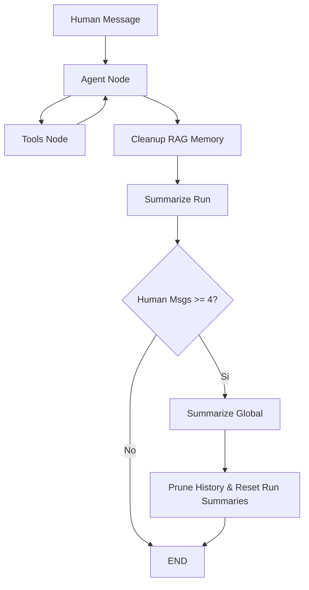

# Memoria Jerárquica en Dos Niveles (Run vs Global)

Este documento explica el funcionamiento técnico del sistema de gestión de memoria implementado en el Agente BMO para optimizar el uso de tokens y mantener el contexto a largo plazo sin saturar el historial.

## 🧠 Arquitectura de Memoria

El sistema divide la memoria en dos estratos:
1. **Memoria de Turno (Run Summary)**: Micro-resúmenes de cada interacción individual.
2. **Memoria Global (Global Summary)**: Consolidación ejecutiva de toda la charla después de un umbral de mensajes.

---

## 1. Resumen de Ejecución (`summarize_run`)

Cada vez que el agente termina una respuesta (sin importar si usó herramientas o no), el nodo `summarize_run` se activa.

- **Trigger**: Se ejecuta al final de **cada turno**.
- **Entrada**: 
    - El mensaje del usuario (`HumanMessage`).
    - La respuesta final del agente (`AIMessage`).
    - El **Procesamiento Intermedio**: Una lista de qué herramientas se llamaron y qué devolvieron (resumido).
- **Acción de Limpieza (Poda Agresiva)**:
    - Inmediatamente después de generar el resumen, todos los mensajes intermedios (pedidos de herramientas y resultados de las mismas) se eliminan del historial de mensajes (`messages`).
    - Solo permanecen en la historia el mensaje original del usuario, la respuesta final del asistente y el nuevo resumen técnico en `run_summaries`.

---

## 2. Resumen Global (`summarize_conversation`)

Para evitar que el historial de mensajes (`messages`) crezca indefinidamente y cause errores de límite de contexto o latencia alta, existe un proceso de **Colapso de Memoria**.

- **Trigger**: Se activa cuando el historial contiene **4 o más mensajes de humanos** (aproximadamente cada 8-12 mensajes totales).
- **Frecuencia**: Aproximadamente cada 4 turnos completos de conversación.
- **Proceso de Generación**:
    1. El LLM toma el **Resumen Global anterior** (si existe).
    2. Toma todos los mensajes del historial **excepto el último par** (último Input y último Output).
    3. Toma todos los `run_summaries` acumulados.
    4. Mezcla todo en un único bloque de texto coherente, manteniendo datos técnicos (versiones, tareas, fechas).
- **Acción de Limpieza (Pruning)**:
    - **Messages**: Se eliminan físicamente de la base de datos de mensajes (PostgreSQL) todos los mensajes que ya fueron resumidos.
    - **Run Summaries**: Se **resetea** la lista de resúmenes de turno a vacía (porque ya están incorporados en el Global).
    - **Preservación**: Solo se mantienen en el historial el último mensaje del usuario y la última respuesta del agente para mantener la fluidez inmediata.

---

## 3. Optimización de RAG (`cleanup_rag_memory`)

Independientemente del resumen, las herramientas de RAG suelen devolver bloques de texto muy pesados.

- **Lógica**: Antes de resumir, el nodo `cleanup_rag_memory` busca mensajes de tipo `ToolMessage` en el historial.
- **Acción**: Si el contenido de un `ToolMessage` supera los 500 caracteres, se trunca y se reemplaza por un aviso: *"[Documentos procesados por el RAG. Removido para optimizar memoria]"*.
- **Impacto**: Esto reduce drásticamente el tamaño del "Checkpoint" en la base de datos, evitando errores de memoria en Oracle/Postgres.

---

## Resumen de Flujo de Datos

> [!IMPORTANT]
> Gracias a este sistema, el Agente BMO puede "recordar" detalles técnicos de hace 100 turnos (vía Global Summary) sin que el costo de cada mensaje aumente proporcionalmente a la duración de la charla.
