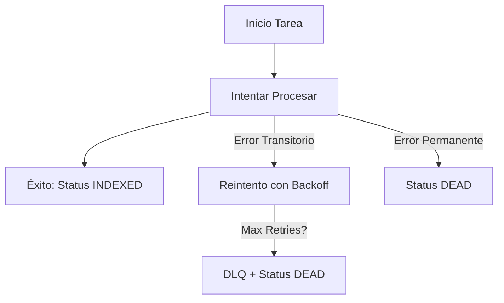

# Fase 3: Ingesta de Datos Robusta - Reporte de Implementación

Este documento detalla las mejoras realizadas para garantizar una ingesta de datos de grado producción, eliminando la pérdida de datos y asegurando el procesamiento único (exactly-once).

## 🎯 Objetivos Logrados

### 1. Infraestructura de Almacenamiento de Objetos (MinIO)
Se integró MinIO para manejar archivos binarios de forma persistente y compartida entre todos los servicios.
- **Componente**: Contenedor `minio/minio` añadido a `docker-compose.yml`.
- **Acceso**: 
    - API/S3: `http://localhost:9000`
    - Console UI: `http://localhost:9001` (Credenciales: admin/password)
- **Persistencia**: Volumen `minio-data` para evitar pérdida de archivos en reinicios.

### 2. Capa de Abstracción de Storage
Implementación de un sistema flexible para el manejo de archivos:
- **`StorageProvider`**: Interfaz base abstracta.
- **`MinioStorageProvider`**: Implementación concreta usando la librería `minio`. Asegura que los archivos se suban antes de encolar tareas.
- **`StorageFactory`**: Permite obtener el proveedor configurado de forma centralizada.

### 3. Seguimiento de Estado en SQL (Ingestion Tracker)
Se implementó un sistema de monitoreo de vida del documento en PostgreSQL:
- **Tabla `ingestion_jobs`**: Registra `doc_id`, `batch_id`, ruta del archivo, estado, intentos y mensajes de error.
- **`StatusProvider`**: Clase encargada de gestionar los cambios de estado (`received` → `queued` → `processing` → `indexed`).
- **Idempotencia**: Se implementó una verificación de existencia en `create_job`. Si el `doc_id` ya existe, el sistema lo ignora en lugar de fallar, permitiendo reintentos seguros desde Kafka o Batch sin duplicar registros.

### 4. Lógica de Ingestión Robusta
Se refactorizó el flujo completo para garantizar que no haya pérdida de datos:
- **API (`src/api/endpoints.py`)**:
    - Genera un `doc_id` (UUID) único.
    - Crea el registro en Postgres *antes* de cualquier otra acción.
    - Sube el archivo a MinIO. En caso de error, el estado se marca como `failed`.
    - Solo después de confirmar la subida, se encola la tarea en Celery pasando el `doc_id`.
- **Worker (`src/workers/tasks.py`)**:
    - Utiliza el `doc_id` para descargar el archivo desde MinIO.
    - Actualiza el estado a `processing` al iniciar y a `indexed` al finalizar.
    - Captura errores para marcar el job como `failed` en Postgres y permitir reintentos automáticos de Celery.
- **Trazabilidad**: El `doc_id` se usa como `source` en los metadatos de los chunks vectoriales, permitiendo un rastreo 1:1 entre los vectores y el archivo original.

### 5. Aislamiento de Usuarios y Metadatos (Seguridad y Búsqueda)
Se implementaron capas de seguridad para evitar que los datos de los usuarios se mezclen:
- **Multi-tenancy en BD**: Se añadió la columna `user_id` a `ingestion_jobs` para rastrear la propiedad de cada carga.
- **Aislamiento en Storage**: Los archivos se guardan en MinIO bajo el prefijo `user_id/doc_id`, asegurando una estructura organizada y privada.
- **Filtros en RAG**: Los endpoints `/query` y `/ask` ahora aceptan un `user_id` opcional para restringir la búsqueda vectorial solo a los documentos pertenecientes a ese usuario.
- **Metadatos Ricos**: Se incluyó la fecha de carga y otros campos extensibles en el registro de tareas y en los metadatos de ChromaDB.

### 6. Fiabilidad y Manejo de Errores (RabbitMQ + Celery)
Se implementaron medidas para garantizar que ningún documento se pierda durante el procesamiento:
- **Persistencia de RabbitMQ**: Las colas se declararon como `durable=True`. Esto asegura que las tareas sobrevivan a un reinicio del broker.
- **Acks Late**: Se configuró `task_acks_late=True`, lo que significa que el mensaje solo se elimina de RabbitMQ *después* de que la tarea se complete con éxito. Si el worker muere a mitad del proceso, la tarea vuelve a la cola.
- **Dead-Letter Queue (DLQ)**: Se configuró `ingest_dlq`. Las tareas que fallan repetidamente (más de 5 intentos) son enviadas a esta cola especial para inspección manual, evitando que bloqueen el flujo principal o se pierdan para siempre.

### 7. Ciclo de Vida del Documento (Postgres)
Cada documento sigue un estado granular que permite monitorear exactamente dónde se encuentra:
- `RECEIVED`: El API recibió el archivo.
- `QUEUED`: El archivo está en MinIO y la tarea está en la cola de RabbitMQ.
- `PROCESSING`: El worker comenzó a procesar.
- `CHUNKING`: Se está dividiendo el documento en fragmentos.
- `EMBEDDING`: Se están generando los vectores de los fragmentos.
- `STORED`: Los vectores han sido guardados en la BD vectorial.
- `INDEXED`: El proceso terminó exitosamente.

### 8. Orquestación Centralizada (`IngestionOrchestrator`)
Para evitar duplicidad entre el API y los consumidores de Kafka, se implementó un `IngestionOrchestrator`:
- Centraliza la creación del Job en Postgres.
- Gestiona la subida de archivos a MinIO si es necesario.
- Encola la tarea en RabbitMQ de forma consistente.
- Ubicación: `src/service/orchestrator.py`.

### 9. Arquitectura de Streaming con Kafka (Fase 3 Final)
Se integró Apache Kafka para soportar flujos continuos de datos:
- **Broker en modo KRaft**: Versión moderna sin ZooKeeper.
- **Tópico `raw-documents`**: Configurado con 6 particiones para escalabilidad horizontal y persistencia de 7 días.
- **Kafka Consumer**: Un worker dedicado (`src/workers/kafka_consumer.py`) que escucha eventos de Kafka y usa el `IngestionOrchestrator` para iniciar el procesamiento.
- **Dead Letter Topic (DLT)**: Tópico `raw-documents-dlt` para mensajes que fallan tras varios reintentos.
- **Soporte de Archivos Pesados (99MB+)**: 
    - Se aumentaron los límites de Kafka (`message.max.bytes`) y Celery (`task_time_limit`) a 100MB y 1 hora respectivamente.
    - Soporte para **Claim Check Pattern** (referencia a MinIO) y **Direct Payload** (contenido en el mensaje de Kafka).
- **Monitoreo**: Interfaz visual Kafka-UI disponible en el puerto `8080`.

### 8. Estrategia de Reintentos y Clasificación de Errores
Se implementó una lógica inteligente para manejar fallos basándose en su naturaleza:

#### Clasificación de Excepciones
1. **Transitorias (`TransientError`)**: Problemas de red, tiempos de espera (timeout) o límites de tasa (rate limits) de APIs externas (Gemini/OpenAI). 
   - **Acción**: Reintento con **backoff exponencial** (60s, 120s, 240s...).
2. **Permanentes (`PermanentError`)**: Archivos corruptos, formatos no soportados o datos faltantes en MinIO.
   - **Acción**: Marcar como `DEAD` inmediatamente, sin reintentos.

#### Flujo de Escalabilidad en Fallos

Esta estructura permite que el sistema se recupere solo de problemas temporales de infraestructura sin desperdiciar recursos en archivos que nunca podrán ser procesados.

---

## 🛠️ Tecnologías Añadidas
- **Object Storage**: MinIO (S3 Compatible)
- **Database Tracking**: SQLAlchemy + PostgreSQL
- **Config**: Pydantic v2 Settings
